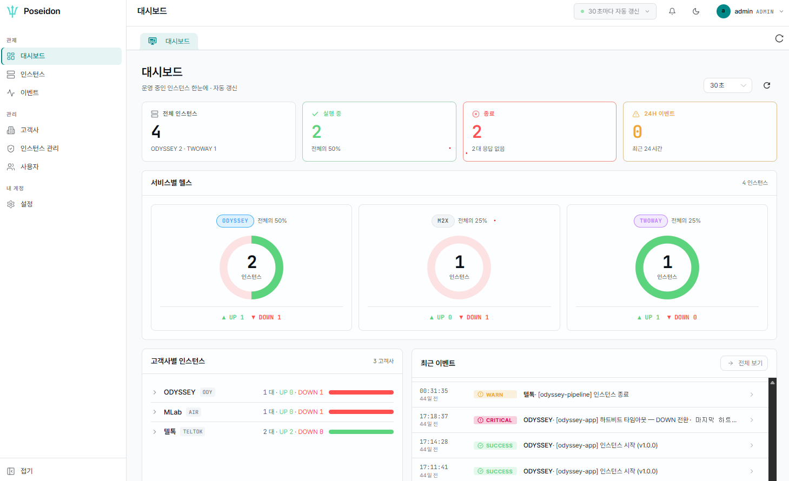

# 2. 화면 구조 한눈에 보기

로그인하면 아래 구조가 나옵니다. 왼쪽 사이드바로 이동하고, 가운데에서 작업합니다.

<figure><figcaption></figcaption></figure>

### <mark style="color:blue;">메뉴 구성 (사이드바)</mark>

***

메뉴는 **3개 그룹 7개 항목**입니다.

| 그룹       | 메뉴          | 주소                                                 | 용도                                                 | 권한                                                  |
| -------- | ----------- | -------------------------------------------------- | -------------------------------------------------- | --------------------------------------------------- |
| **관제**   | **대시보드**    | <mark style="color:red;">`/dashboard`</mark>       | 전체 현황 요약                                           | 전체                                                  |
|          | **인스턴스**    | <mark style="color:red;">`/instances`</mark>       | 실시간 상태 목록 → 상세 진입                                  | 전체                                                  |
|          | **이벤트**     | <mark style="color:red;">`/events`</mark>          | 최근 7일 기동·종료·오류 이력                                  | 전체                                                  |
| **관리**   | **고객사**     | <mark style="color:red;">`/tenants`</mark>         | 고객사 등록·조회 → 상세 진입                                  | 조회 전체 / 등록·삭제 <mark style="color:red;">ADMIN</mark> |
|          | **인스턴스 관리** | <mark style="color:red;">`/admin-instances`</mark> | 승인·거절·해지, <mark style="color:red;">API 키 발급</mark> | <mark style="color:red;">ADMIN</mark> **전용**        |
|          | **사용자**     | <mark style="color:red;">`/admin-users`</mark>     | 운영자 계정 승인·거절·잠금·해제                                 | <mark style="color:red;">ADMIN</mark> **전용**        |
| **내 계정** | **설정**      | <mark style="color:red;">`/settings`</mark>        | 내 정보, 비밀번호 변경                                      | 전체                                                  |


**`인스턴스`(관제)와 `인스턴스 관리`(관리)는 완전히 다른 화면입니다.**

* **인스턴스** = 지금 살아있는지 보는 곳 (<mark style="color:red;">`UP`</mark> / <mark style="color:red;">`DOWN`</mark>)
* **인스턴스 관리** = 등록 절차를 처리하는 곳 (<mark style="color:red;">`PENDING`</mark> / <mark style="color:red;">`APPROVED`</mark> / <mark style="color:red;">`REVOKED`</mark>, API 키 발급)


사이드바 맨 아래 **접기** 버튼으로 아이콘만 남기고 폭을 줄일 수 있습니다. 

### <mark style="color:blue;">메뉴에 없는 화면 2개</mark>

***

목록에서 **행을 클릭**해야 열리는 화면이 두 개 있습니다. 사이드바에는 나오지 않습니다.

<table><thead><tr><th width="207.75">화면</th><th>여는 방법</th><th>주소</th></tr></thead><tbody><tr><td><strong>인스턴스 상세</strong></td><td>인스턴스 목록에서 행 클릭 (또는 대시보드에서 인스턴스 칩·이벤트 클릭)</td><td><mark style="color:red;"><code>/instances-detail?id=…</code></mark></td></tr><tr><td><strong>고객사 상세</strong></td><td>고객사 목록에서 행 클릭 (또는 카드 클릭)</td><td><mark style="color:red;"><code>/tenants-detail?id=…</code></mark></td></tr></tbody></table>

### <mark style="color:blue;">상단바</mark>

***

<table><thead><tr><th width="207">요소</th><th>의미</th></tr></thead><tbody><tr><td><strong>왼쪽 제목</strong></td><td>현재 보고 있는 화면 이름</td></tr><tr><td><strong><code>● 30초마다 자동 갱신</code></strong></td><td><strong>표시만 되는 안내 버튼입니다. 비활성 상태라 눌러도 동작하지 않습니다.</strong> 실제 갱신 주기는 각 화면 안의 선택기로 바꿉니다</td></tr><tr><td>🔔 <strong>알림 아이콘</strong></td><td><strong>아직 동작하지 않습니다</strong> (<a href="../part-2/9.-settings.md">9. 설정</a> 알림 = 준비 중)</td></tr><tr><td>🌙 / ☀</td><td>다크 모드 ↔ 라이트 모드 전환</td></tr><tr><td><strong>사용자 영역</strong></td><td>아바타·이름·역할 표시. 클릭하면 <strong>로그아웃</strong></td></tr></tbody></table>

### <mark style="color:blue;">탭 바</mark>

***

**인스턴스 상세**와 **고객사 상세**는 열 때마다 상단에 **탭으로 쌓입니다**. 여러 고객사를 비교할 때 유용합니다.

<table><thead><tr><th width="207.75">탭</th><th>라벨 형식</th></tr></thead><tbody><tr><td><strong>인스턴스 상세</strong></td><td><mark style="color:$info;"><strong><code>고객사명(공백 제거 8자) - 인스턴스명</code></strong></mark></td></tr><tr><td><strong>고객사 상세</strong></td><td><mark style="color:$info;"><strong><code>고객사명</code></strong></mark></td></tr></tbody></table>

탭에서 **마우스 오른쪽 클릭**하면 <mark style="color:red;">`닫기 / 다른 탭 닫기 / 왼쪽 탭 닫기 / 오른쪽 탭 닫기 / 모두 닫기 / 탭 고정`</mark>을 쓸 수 있습니다. 

### <mark style="color:blue;">자동 갱신 — 화면마다 다릅니다</mark>

***

자동 갱신이 있는 화면에는 **우측 상단에 주기 선택기**(<mark style="color:red;">`30초 / 1분 / 5분 / OFF`</mark>)와 새로고침 버튼이 있습니다.

| 화면                | 자동 갱신  | 기본 주기                               |
| ----------------- | ------ | ----------------------------------- |
| **대시보드**          | 있음     | <mark style="color:red;">30초</mark> |
| **인스턴스 (목록)**     | 있음     | <mark style="color:red;">30초</mark> |
| **이벤트**           | 있음     | <mark style="color:red;">1분</mark>  |
| **인스턴스 상세**       | 있음     | <mark style="color:red;">1분</mark>  |
| **고객사 / 고객사 상세**  | **없음** | — (`새로고침` 버튼)                       |
| **인스턴스 관리 / 사용자** | **없음** | — (`새로고침` 버튼, 작업 후 자동 재조회)          |
| **설정**            | 없음     | —                                   |


**브라우저 탭을 다른 탭으로 옮기면 자동 갱신이 멈춥니다.** 다시 돌아오면 즉시 한 번 갱신한 뒤 재개됩니다. 오래 방치했다 돌아온 화면의 숫자는 이미 최신입니다.


### <mark style="color:blue;">화면에서 자주 보는 상태 값 — 3종류를 구분하십시오</mark>

***

성격이 전혀 다른 "상태"가 세 종류 나옵니다.

<table><thead><tr><th width="172">구분</th><th>나오는 화면</th><th>값</th><th>의미</th></tr></thead><tbody><tr><td><strong>엔진 상태</strong></td><td>대시보드, 인스턴스, 인스턴스 상세</td><td><mark style="color:red;"><code>UP</code></mark> / <mark style="color:red;"><code>DOWN</code></mark></td><td>고객사 엔진이 <strong>살아있는지</strong> (하트비트 기준)</td></tr><tr><td><strong>등록 상태</strong></td><td>인스턴스 관리, 고객사 상세</td><td><mark style="color:red;"><code>PENDING</code></mark> / <mark style="color:red;"><code>APPROVED</code></mark> / <mark style="color:red;"><code>REJECTED</code></mark> / <mark style="color:red;"><code>REVOKED</code></mark></td><td>API 키 <strong>발급·승인 절차상의 단계</strong></td></tr><tr><td><strong>계정 상태</strong></td><td>사용자</td><td><mark style="color:red;"><code>PENDING</code></mark> / <mark style="color:red;"><code>ACTIVE</code></mark> / <mark style="color:red;"><code>SUSPENDED</code></mark> / <mark style="color:red;"><code>REJECTED</code></mark></td><td>우리 팀 <strong>운영자 계정</strong> 상태</td></tr></tbody></table>


<mark style="color:red;">`APPROVED`</mark>(등록 승인 완료)와 <mark style="color:red;">`UP`</mark>(엔진 가동 중)은 전혀 다른 뜻입니다. **키는 승인됐지만 고객사가 아직 엔진을 안 켰거나 방화벽이 막혀 있으면**, 인스턴스 관리에서는 <mark style="color:red;">`APPROVED`</mark>인데 인스턴스 화면에는 아예 안 뜨거나 <mark style="color:red;">`DOWN`</mark>으로 보입니다.


### <mark style="color:blue;">서비스 타입 칩</mark>

***

인스턴스가 어떤 제품인지 색 칩으로 구분합니다. 전 화면 공통입니다.

| 칩             | 색                                       | 제품                    |
| ------------- | --------------------------------------- | --------------------- |
| **`ODYSSEY`** | <mark style="color:blue;">파랑</mark>     | 발송 엔진                 |
| **`TWOWAY`**  | <mark style="color:purple;">보라</mark>   | 수신(양방향) 엔진            |
| **`CS`**      | <mark style="color:$success;">청록</mark> | 데스크톱 메시징 클라이언트        |
| **`M2X`**     | <mark style="color:$info;">갈색</mark>    | 레거시 (Cypher 사이드카로 감시) |

### <mark style="color:blue;">시각 표기</mark>

***

| 표기                                               | 의미                     |
| ------------------------------------------------ | ---------------------- |
| **`12초 전`**, **`5분 전`**, **`3시간 전`**, **`2일 전`** | 상대 시간 (하트비트·이벤트 발생 등)  |
| **`14:23:07`**                                   | **오늘** 발생              |
| **`어제 14:23`**                                   | 어제 발생                  |
| **`07-28 14:23`**                                | 그 이전                   |
| **`2026. 07. 30. 14:23`**                        | 절대 시각 (에러 상세의 발생 시각 등) |
| **`-`**                                          | 값 없음 (한 번도 수신되지 않음)    |
